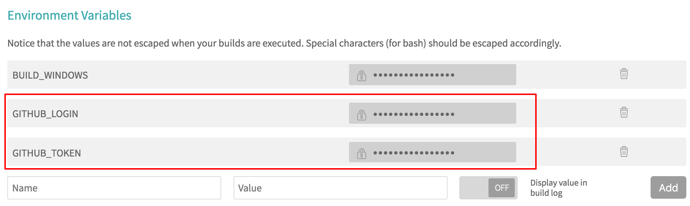

How it's working?
=================
If:

* a successful build of the binaries took place
* *the current build is tagged*

a new Debian package will be generated (with an updated changelog based on the git commit messages and authors).

The package will get uploaded to GitHub as a release asset. The target release is named exactly the same as the 
build tag. If a release with such a name does not yet exist, it will get automatically created.

IMPORTANT: in the case when a release asset with the exact same name already exists, it will get replaced with the 
newly generated file.

How to configure Travis and GitHub?
===================================
Before you can start building the Debian packages, you'll have to configure GitHub and Travis accordingly.

GitHub
------
1. Log in to your (or for that matter - any valid / selected) GitHub account and go to "Settings / Developer settings / Personal access tokens".
2. Generate a new token that has read/create/edit/delete permissions on your project's repository.
3. Store the token somewhere as you won't get a second chance to do that.
4. Store also your GitHub project username somewhere because you'll need it (i.e. if the URL is 
https://github.com/foo-bar/moolticute/ then the username you need to store is 'foo-bar').

NOTE! This is the username of the GitHub account under which the repository resides. It has a simple form like 'foo' 
or 'foo-bar', but *it's not an e-mail*! Also note, that if you're using an access token of a different account than
your project's account (for example: a machine user account) then you have to record here the username of the original 
repository, not the new one (not the machine account's one).

After doing that you should have two things prepared and ready:
1. a GitHub username (the one of the account you have used to generate the new token)
2. a GitHub token

Now you're ready to configure Travis.

Travis
------
1. Log in to your Travis account and add the project's repository to Travis the same way you would do with any other project
2. Go to your project's option menu and select "Settings":

3. Scroll down to the "Environment Variables" section and add the following variables that will be used to access the GitHub
repository of the project and build the project:
  GITHUB_LOGIN which value should be set to the username/login of the GitHub account described earlier
  GITHUB_TOKEN which value should be set to that of the token you have recently created
  DOCKER_IMAGE which value should be set to the name of the Moolticute build environment image on DockerHub
Make the first two variables secret ones - we don't want to show them to anyone (especially the token):


Voila! That should be enough for the scripts to be able to manage the releases of your project (including the assets 
related to a specific release).

How to build?
=============
The project contains a makefile which defines a few targets. Each target is basically a list of shell commands with 
different results on the end.

```bash
make build
```
Builds the project (creates the binaries and nothing more).

```bash
make debian
```
Both - builds the project and after that generates a .deb package (it does not upload it however anywhere).

```bash
make github_upload
```
Uploads the .deb package to GitHub, creating new releases or updating existing ones, if needed.

Debugging
---------
If you encounter any problems during the builds, it's helpful to turn on the debug mode in the makefile.
To do so simply add the parameter DEBUG=1 to the make command:

```bash
make debian DEBUG=1
```

The debug mode simply enables a few print-like instructions that will dump the most important variables to the console.
This way you'll have more information about what's exactly happening in the scripts.

If you're building with Travis, this will require you to edit `.travis.yml` accordingly. 

Important facts about the build process
=======================================
The make commands utilize Docker to build the project - a disposable container is being created each time a build is 
started. The container is based on a custom image stored on DockerHub (you can find the Dockerfile of that image in 
docker/Dockerfile and create your own version of it on your personal DockerHub account).

How to use your own Docker image stored on DockerHub to build the project?
--------------------------------------------------------------------------
That's pretty straightforward:
1. Create a DockerHub account.
2. Create a new project and point it to this project's repository on GitHub.
3. When asked about the Dockerfile's location, specify it as described above.
4. Wait for the build to finish (it should start automatically right after you've created the DockerHub project 
and connected it with your GitHub account).
5. Note down the name of your image (usually it's something like my-username-on-dockerhub/my-project) and edit the file 
`docker-compose.yml` modifying this line:
```yaml
image: tomaszjaniczek/moolticute
```
to
```yaml
image: my-username-on-dockerhub/my-project
```
6. Start `make build` to be sure the build works
7. Commit your changes to the repository
8. Done
